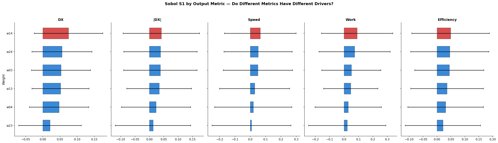
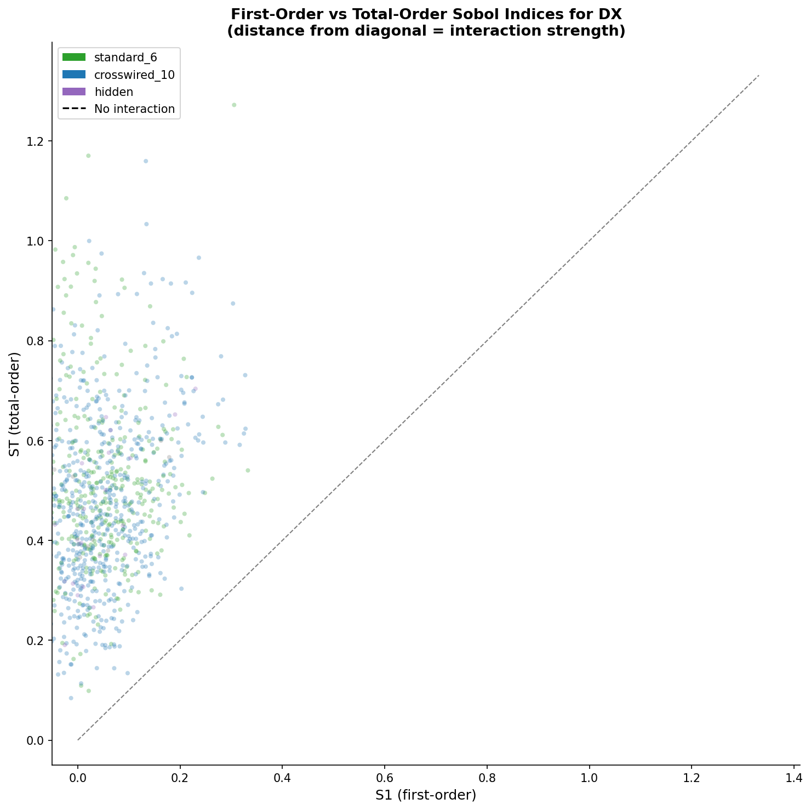
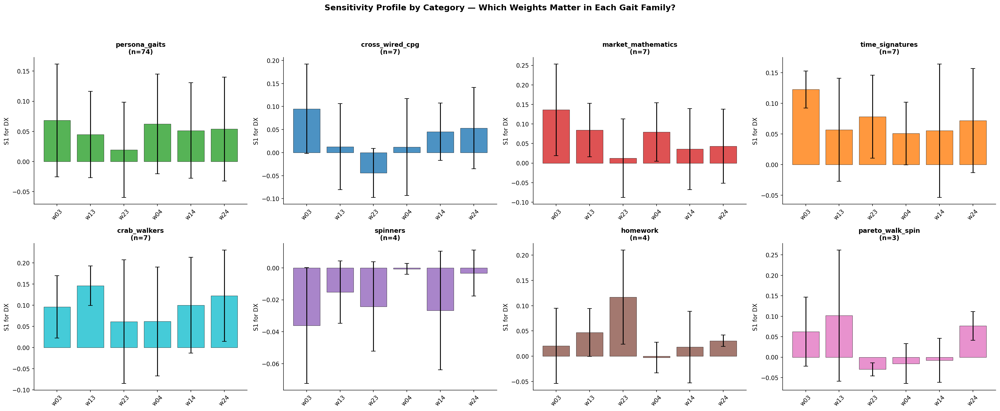
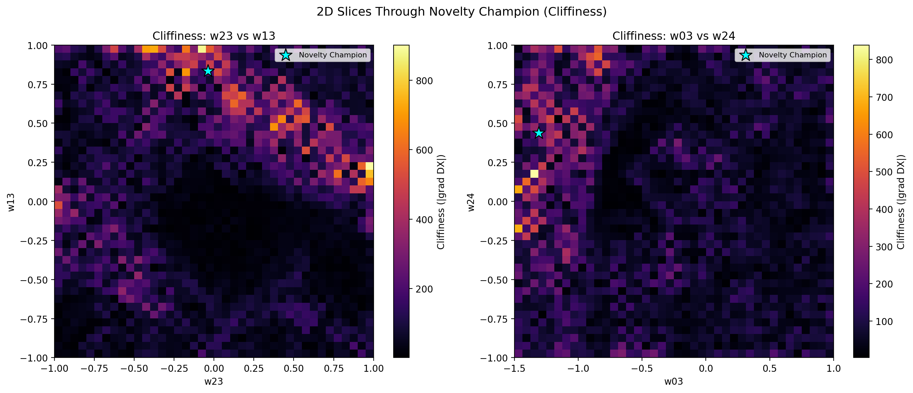
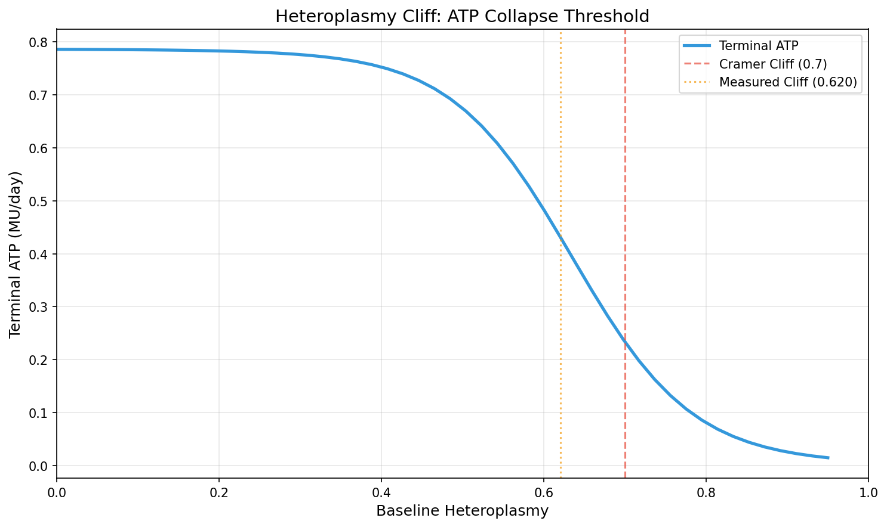
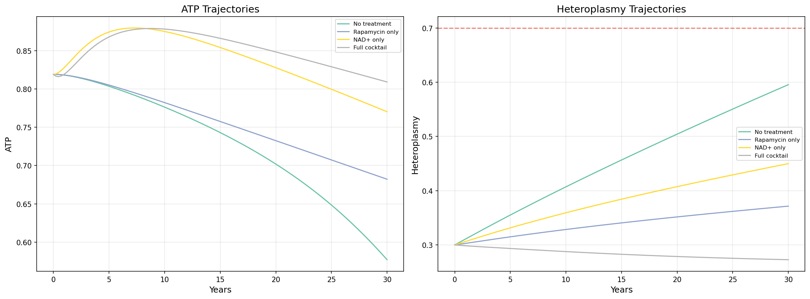

# Zimmerman Toolkit

A generalized library for interrogating black-box simulators through fourteen complementary lenses. Given any simulator that satisfies a simple protocol -- `run(params) -> dict` and `param_spec() -> bounds` -- the toolkit answers the questions that matter: what inputs drive outcomes, where are the tipping points, does the system do what you think it does, where does it break, and how does meaning flow through it.

Based on Julia Zimmerman's (she/her) 2025 PhD dissertation at the University of Vermont: *"Locality, Relation, and Meaning Construction in Language, as Implemented in Humans and Large Language Models (LLMs)."* Eleven of the fourteen modules operationalize specific dissertation findings; the other three (Sobol, Falsifier, ContrastiveGenerator) implement classical analysis techniques that serve the thesis-derived tools.

Extracted and generalized from the [how-to-live-much-longer](../how-to-live-much-longer) mitochondrial aging simulator project, where each module first proves its value on a concrete research problem before being lifted into a simulator-agnostic library.

See [`docs/guide.md`](docs/guide.md) for the full reference guide with thesis context, and [`docs/`](docs/) for Wolfram-style documentation of every public API.

## Installation

Pure Python + numpy. No scipy, no SALib, no external dependencies beyond numpy.

```bash
pip install numpy
```

## The Simulator Protocol

Any object that provides two methods can be analyzed by the full toolkit:

```python
class MySimulator:
    def run(self, params: dict) -> dict:
        """Execute simulation. Returns named numeric outputs."""
        x = params["x"]
        return {"y": x ** 2, "z": x + 1}

    def param_spec(self) -> dict[str, tuple[float, float]]:
        """Return parameter bounds: {name: (low, high)}."""
        return {"x": (0.0, 10.0)}
```

For standalone functions, use the `SimulatorWrapper`:

```python
from zimmerman import SimulatorWrapper

def my_model(params):
    return {"output": params["a"] + params["b"]}

sim = SimulatorWrapper(my_model, {"a": (0.0, 1.0), "b": (-1.0, 1.0)})
```

## Modules

### Tier 1 -- Classical Analysis

#### `sobol` -- What inputs matter?

Global sensitivity analysis via Saltelli sampling and Sobol indices. Reveals which parameters actually drive outcomes vs. which are noise.

- **S1 (first-order):** fraction of output variance explained by each parameter alone
- **ST (total-order):** fraction due to each parameter and all its interactions
- **ST - S1:** the interaction contribution

Pure numpy implementation of the Saltelli (2002) sampling scheme with Jansen (1999) estimators. No SALib dependency.

```python
from zimmerman import sobol_sensitivity

result = sobol_sensitivity(my_sim, n_base=256, seed=42)

# Which parameter drives displacement the most?
print(result["dx"]["S1"])      # {"w03": 0.42, "w04": 0.31, ...}
print(result["dx"]["ST"])      # Total-order (includes interactions)
print(result["rankings"])      # Sorted by influence
```

Total simulations: `N * (D + 2)` where N = `n_base`, D = number of parameters.

#### `falsifier` -- Where does it break?

Systematically probes the parameter space looking for violations: NaN outputs, infinities, and broken assumptions. Three testing strategies applied in sequence:

1. **Random sampling** -- uniformly random parameter combinations
2. **Boundary testing** -- corners, edges, and faces of the parameter hypercube (where numerical issues like overflow and division-by-zero most often occur)
3. **Adversarial testing** -- perturbed variants near already-found violations, probing whether failures are isolated points or entire regions

This module found 4 real bugs in the JGC mitochondrial ODE equations.

```python
from zimmerman import Falsifier

# Default assertions: no NaN, no Inf, all finite
falsifier = Falsifier(my_sim)

# Custom assertions
falsifier = Falsifier(my_sim, assertions=[
    lambda r: r["energy"] >= 0,       # energy must be non-negative
    lambda r: r["health"] <= 1.0,     # health capped at 1.0
    lambda r: abs(r["dx"]) < 100.0,   # robot shouldn't teleport
])

report = falsifier.falsify(n_random=200, n_boundary=50, n_adversarial=50)
print(f"Found {report['summary']['violations_found']} violations")
print(f"Violation rate: {report['summary']['violation_rate']:.1%}")
```

#### `contrastive` -- Where are the tipping points?

Finds the smallest parameter change that flips the outcome from one category to another. Uses bisection along random perturbation directions to locate decision boundaries in parameter space.

Useful for understanding fragility, generating adversarial examples, and finding the exact point where a robot stops walking and starts falling.

```python
from zimmerman import ContrastiveGenerator

gen = ContrastiveGenerator(
    my_sim,
    outcome_fn=lambda r: "forward" if r["dx"] > 0 else "backward"
)

pair = gen.find_contrastive(
    base_params={"w03": 0.855, "w04": -0.659, ...},
    n_attempts=100,
    max_delta_frac=0.1,  # search within 10% of parameter ranges
)

if pair["found"]:
    print(f"Flip magnitude: {pair['perturbation_magnitude']:.4f}")
    print(f"Delta: {pair['delta']}")  # which params changed most

# Batch analysis: which parameters are most involved in flips?
pairs = gen.contrastive_pairs(list_of_weight_dicts, n_per_point=5)
sensitivity = gen.sensitivity_from_contrastives(pairs)
print(sensitivity["rankings"])  # params sorted by flip involvement
```

### Tier 2 -- Alignment & Design

#### `posiwid` -- Does it do what you think?

POSIWID alignment auditor: "The Purpose Of a System Is What It Does" (Stafford Beer, 1974). Measures the gap between intended outcomes and actual simulation results.

Given intended outcomes (from an LLM, a human designer, or an optimization target) and actual parameters, how well do the actual results match the intention?

```python
from zimmerman import POSIWIDAuditor

auditor = POSIWIDAuditor(my_sim)

# Single audit
result = auditor.audit(
    intended_outcomes={"dx": 5.0, "speed": 0.8},
    params={"w03": 0.5, "w04": -0.3, ...},
)
print(result["alignment"]["overall"])         # 0.0 to 1.0
print(result["alignment"]["per_key"]["dx"])   # direction + magnitude match

# Batch audit across multiple scenarios
report = auditor.batch_audit([
    {"intended": {"dx": 5.0}, "params": weights_a},
    {"intended": {"dx": -2.0}, "params": weights_b},
])
print(report["aggregate"]["mean_overall"])
```

Alignment scoring per output key:
- **direction_match:** did the value move in the expected direction? (binary)
- **magnitude_match:** how close is actual to intended? (continuous 0-1)
- **combined:** 50/50 weighted average

#### `pds` -- What do abstract concepts map to?

Parameter-Design-State dimension mapper. Maps abstract high-level dimensions (Power, Danger, Stability) to weighted combinations of concrete simulator parameters. Lets domain experts reason about simulations in meaningful terms rather than raw parameter names.

From ousiometric analysis of word meanings (Dodds et al. 2023); applied to simulation via Zimmerman (2025) §4.6.4.

```python
from zimmerman import PDSMapper

mapper = PDSMapper(
    simulator=my_sim,
    dimension_names=["aggression", "stability"],
    dimension_to_param_mapping={
        "aggression": {"w03": 0.5, "w04": 0.3},
        "stability": {"w13": -0.4, "w23": 0.2},
    },
)

# Convert abstract dimensions to concrete params
params = mapper.map_dimensions_to_params({"aggression": 0.8, "stability": -0.3})

# Audit how well the abstract dimensions predict outcomes
audit = mapper.audit_mapping(n_samples=100)
print(audit["variance_explained"])                # R^2 per output
print(audit["dimension_output_correlations"])      # correlation matrix

# Which dimensions matter most?
sensitivity = mapper.sensitivity_per_dimension(n_samples=100)
print(sensitivity["aggression"]["overall"])
```

#### `prompts` -- How should an LLM talk to it?

Diegetic prompt builder for LLM-mediated parameter generation. Three prompt styles based on Zimmerman's finding (§2.2.3) that LLMs handle diegetic content (meaning) better than supradiegetic content (form/numbers), compounded by tokenization-induced flattening of numeric content (§3.5.3):

```python
from zimmerman import PromptBuilder

builder = PromptBuilder(my_sim, context={"domain": "3-link walking robot"})

# Style 1: Numeric -- straightforward parameter request with bounds
prompt = builder.build_numeric("Design a fast robot that walks forward")

# Style 2: Diegetic -- parameters embedded in a domain narrative
prompt = builder.build_diegetic(
    "Design a fast robot that walks forward",
    state_description="Currently the robot flips after 2 seconds",
)

# Style 3: Contrastive -- two opposing agents bracket the problem
# Exploits TALOT/OTTITT meaning-from-contrast (Zimmerman §4.7.6)
prompt = builder.build_contrastive(
    "Design a walking robot",
    agent_a="cautious engineer",
    agent_b="aggressive optimizer",
)
```

### Tier 3 -- Meaning Construction

#### `contrast_set_generator` -- What does the edit-space look like?

Structured contrast set generation via TALOT/OTTITT (Zimmerman §4.7.6). While `ContrastiveGenerator` finds single minimal-flip pairs, this module generates *structured sets* of contrasts -- systematic per-axis edits that map how behavior changes along each parameter dimension.

Traces edit paths through parameter space and locates the exact tipping points where qualitative behavior flips, connecting to catastrophe theory (Thom, 1975).

```python
from zimmerman import ContrastSetGenerator

gen = ContrastSetGenerator(
    my_sim,
    outcome_fn=lambda r: "forward" if r["dx"] > 0 else "backward",
)

# Generate contrast sets along each parameter axis
result = gen.generate(
    base_params={"w03": 0.5, "w04": -0.3, ...},
    n_steps=10,  # 10 edit steps per axis
)
print(result["axes"])           # per-axis tipping points and edit paths
print(result["flip_summary"])   # which axes flip behavior, and where
```

#### `locality_profiler` -- Are effects local or global?

Measures how local a simulator's behavior is via five manipulation sweeps (Zimmerman §2.3--§2.5): prefix ablation, suffix ablation, noise injection, shuffle, and distraction. Produces locality decay curves characterizing the system's effective horizon.

```python
from zimmerman import LocalityProfiler

profiler = LocalityProfiler(my_sim)

result = profiler.profile(
    base_params={"w03": 0.5, "w04": -0.3, ...},
    n_intensities=10,
)
print(result["decay_curves"])       # per-manipulation output degradation
print(result["effective_horizon"])  # radius beyond which perturbations don't matter
print(result["linearity_scores"])   # linear vs nonlinear response per parameter
```

#### `relation_graph_extractor` -- What is the relational structure?

Builds a three-frame relation multigraph (causal, similarity, contrast) around any point in parameter space (Zimmerman §2--3). The meaning of a parameter configuration is defined not by its values but by its web of relationships.

```python
from zimmerman import RelationGraphExtractor

ext = RelationGraphExtractor(my_sim)

graph = ext.extract(
    base_params={"w03": 0.5, "w04": -0.3, ...},
    n_probes=100,
)
print(graph["causal_frame"])      # gradient-based causal edges
print(graph["similarity_frame"])  # cosine-similar neighbors in output space
print(graph["contrast_frame"])    # maximally dissimilar configurations
print(graph["rankings"])          # most causal params, strongest edges
```

#### `diegeticizer` -- Can we translate parameters to narrative and back?

Reversible bin-based translation between parameter vectors and narrative descriptions (Zimmerman §2.2.3, §3.5.3). Parameters become "very low"/"low"/"medium"/"high"/"very high" labels; the reverse translation recovers bin midpoints. Roundtrip error quantifies information loss.

```python
from zimmerman import Diegeticizer

dieg = Diegeticizer(my_sim, lexicon={"w03": "front leg drive", "w04": "rear leg push"})

narrative = dieg.diegeticize({"w03": 0.82, "w04": -0.15})
# "front leg drive is high; rear leg push is very low"

recovered = dieg.re_diegeticize(narrative)
error = dieg.roundtrip_error({"w03": 0.82, "w04": -0.15})
print(f"Information loss: {error:.4f}")
```

#### `token_extispicy` -- Where does tokenization damage numeric content?

Maps the fragmentation hazard surface across parameter space (Zimmerman §3.5.3). Accepts any tokenizer callback (`tiktoken`, `SentencePiece`, or default whitespace+digit splitter). Reveals which parameter values get tokenized destructively and how that correlates with LLM output instability.

The name is deliberate: like Mesopotamian diviners reading entrails, we read tokenizer boundaries to predict where representational hazards lurk.

```python
from zimmerman import TokenExtispicyWorkbench

workbench = TokenExtispicyWorkbench(my_sim)  # default tokenizer
# workbench = TokenExtispicyWorkbench(my_sim, tokenize=enc.encode)  # tiktoken

result = workbench.analyze(n_samples=200, seed=42)
print(result["hazard_surface"])         # per-parameter fragmentation rates
print(result["worst_values"])           # parameter values with highest fragmentation
print(result["fragmentation_vs_output"])  # correlation with output instability
```

#### `supradiegetic_benchmark` -- Do diegetic prompts outperform numeric ones?

Standardized form-vs-meaning battery (Zimmerman §2.2.3, Ch. 5). Generates paired tasks -- same content as raw numbers (supradiegetic) vs. narrative labels (diegetic) -- across five probes: palindrome, table, digits, boundary, and monotone. Measures the *diegeticization gain*.

```python
from zimmerman import SuperdiegeticBenchmark

bench = SuperdiegeticBenchmark(my_sim)
battery = bench.generate_battery(n_scenarios=20, seed=42)

# Each scenario has .supradiegetic (numeric) and .diegetic (narrative) versions
for task in battery:
    print(task["category"], task["supradiegetic_prompt"], task["diegetic_prompt"])
```

#### `prompt_receptive_field` -- Which input segments drive which outputs?

Sobol-based feature attribution over input segments (Zimmerman §4.6, §4.7). Treats each parameter group or prompt section as a segment with a continuous inclusion weight, then runs Saltelli sampling over those weights. S1 indices reveal main effects; ST - S1 reveals relational interactions between segments.

```python
from zimmerman import PromptReceptiveField

prf = PromptReceptiveField(my_sim)

result = prf.analyze(
    segments={"locomotion": ["w03", "w04"], "balance": ["w13", "w14", "w23", "w24"]},
    n_base=128,
)
print(result["S1"])    # main effect per segment
print(result["ST"])    # total effect (including interactions)
print(result["interactions"])  # segment pairs with strongest coupling
```

### Tier 4 -- Synthesis

#### `meaning_construction_dashboard` -- What does the full picture look like?

Unified aggregator across all other tools (Zimmerman Ch. 6). Compiles reports from Sobol, Falsifier, POSIWID, LocalityProfiler, and the rest into a multi-dimensional assessment with six analytical sections: sensitivity, robustness, locality, alignment, form, and relation. Generates cross-section recommendations.

```python
from zimmerman import MeaningConstructionDashboard

dash = MeaningConstructionDashboard(my_sim)

reports = {
    "sobol": sobol_sensitivity(my_sim),
    "falsifier": Falsifier(my_sim).falsify(),
    "posiwid": POSIWIDAuditor(my_sim).batch_audit(scenarios),
    "locality": LocalityProfiler(my_sim).profile(base_params),
}

result = dash.compile(reports)
print(result["sections"])           # 6 analytical sections
print(result["recommendations"])    # cross-section insights
print(dash.to_markdown(result))     # full report as markdown
```

## Sample Visualizations

These figures were produced by the toolkit's downstream projects — a 3-link PyBullet walking robot (Evolutionary Robotics) and a mitochondrial aging ODE (how-to-live-much-longer).

### `sobol_sensitivity` — Which weights drive displacement? Do different outputs have different drivers?



*First-order Sobol indices (S1) for 6 synapse weights across 5 behavioral metrics. Weight w14 dominates displacement and speed; w24 matters more for efficiency. Each output has a distinct sensitivity profile — the answer to "what matters?" depends on what you're measuring.*

### `sobol_sensitivity` — How much is interaction vs. main effect?



*First-order (S1) vs. total-order (ST) Sobol indices for displacement across 112 gaits. Points above the diagonal have strong interaction effects — the weight's influence depends on other weights. Most robot gaits are interaction-dominated (clustered at low S1, high ST), meaning no single weight controls behavior in isolation.*

### `sobol_sensitivity` — Do different gait families have different sensitivity profiles?



*Per-category sensitivity profiles for 8 gait families. Persona gaits (n=74) show balanced sensitivity; crab walkers concentrate influence on w03/w13; spinners show near-zero S1 (pure interaction). The toolkit reveals that different behavioral regimes have fundamentally different causal structures.*

### `ContrastiveGenerator` / cliff analysis — Where are the behavioral cliffs?



*2D slices through 6D weight space showing cliffiness (gradient magnitude of displacement). Bright regions are behavioral cliffs — tiny parameter changes cause large behavioral shifts. The cyan star marks a champion gait perched near a cliff edge. This is what `ContrastiveGenerator` finds: the boundaries where one behavior becomes another.*

### Simulator protocol — The heteroplasmy cliff (mitochondrial aging ODE)



*The cliff phenomenon in a different simulator: terminal ATP production vs. baseline heteroplasmy (fraction of damaged mtDNA). Above ~70% damage, ATP collapses nonlinearly. The same toolkit that maps behavioral cliffs in a walking robot maps cellular energy cliffs in mitochondrial aging — the protocol is simulator-agnostic.*

### Simulator protocol — Intervention comparison trajectories



*30-year ATP and heteroplasmy trajectories under four treatment protocols (no treatment, rapamycin only, NAD+ only, full cocktail). The red dashed line is the heteroplasmy cliff at 0.70. Same simulator protocol, different domain — the toolkit's `POSIWIDAuditor` measures how well each protocol achieves its intended outcomes.*

## Projects Using the Toolkit

Three simulators currently satisfy the Zimmerman protocol:

| Project | Simulator | Parameters | Outputs |
|---------|-----------|------------|---------|
| [Evolutionary Robotics](../pybullet_test/Evolutionary-Robotics) | `SimulatorWrapper` around `run_trial_inmemory()` | 6 synapse weights (w03..w24), each in [-1, 1] | dx, speed, efficiency, work |
| [how-to-live-much-longer](../how-to-live-much-longer) | JGC mitochondrial aging ODE | 6 patient/treatment params | het_final, atp_final, lifespan |
| [stock-simulator](../stock-simulator) | `StockSimulator` (7D financial ODE) | 6 strategy params | portfolio_value, sharpe, max_drawdown |

The ER integration is in `zimmerman_analysis.py` at the Evolutionary Robotics project root, which provides convenience wrappers:

```python
from zimmerman_analysis import run_sobol_analysis, run_falsification, run_contrastive

# Sobol: which of the 6 synapse weights matters most for displacement?
sobol = run_sobol_analysis(n_base=64)

# Falsifier: find weight combos that produce NaN or teleportation
report = run_falsification(n_random=50)

# Contrastive: smallest weight change that reverses walking direction
champion = {"w03": 0.855, "w04": -0.659, "w13": 0.204,
            "w14": -0.911, "w23": 0.478, "w24": -0.738}
pair = run_contrastive(champion, n_attempts=50)
```

## Documentation

Full Wolfram-style reference documentation for every public class and function lives in [`docs/`](docs/):

- [`docs/guide.md`](docs/guide.md) -- Reference guide with thesis context and workflow
- [`docs/sobol_sensitivity.md`](docs/sobol_sensitivity.md), [`docs/Falsifier.md`](docs/Falsifier.md), etc. -- Per-module pages with calling patterns, details, examples, applications, properties, and known issues

## References

- Zimmerman, J.W. (2025). "Locality, Relation, and Meaning Construction in Language, as Implemented in Humans and Large Language Models (LLMs)." PhD dissertation, University of Vermont. Graduate College Dissertations and Theses, 2082.
- Zimmerman, J.W., Hudon, D., Cramer, K., St-Onge, J., Fudolig, M., Trujillo, M.Z., Danforth, C.M., and Dodds, P.S. (2024). "A blind spot for large language models: Supradiegetic linguistic information." *Plutonics*, 17, 107-156.
- Dodds, P.S., Alshaabi, T., Fudolig, M.I., Zimmerman, J.W., Lovato, J., Beaulieu, S., Minot, J.R., Arnold, M.V., Reagan, A.J., and Danforth, C.M. (2023). "Ousiometrics and telegnomics: The essence of meaning conforms to a two-dimensional powerful-weak and dangerous-safe framework." *arXiv*.
- Saltelli, A. (2002). "Making best use of model evaluations to compute sensitivity indices." *Computer Physics Communications*, 145(2), 280-297.
- Jansen, M.J.W. (1999). "Analysis of variance designs for model output." *Computer Physics Communications*, 117(1-2), 35-43.
- Beer, S. (1974). "Designing Freedom." CBC Massey Lectures.
- Lipton, P. (1990). "Contrastive Explanation." *Royal Institute of Philosophy Supplement*, 27, 247-266.
- Thom, R. (1975). *Structural Stability and Morphogenesis.* W.A. Benjamin.
